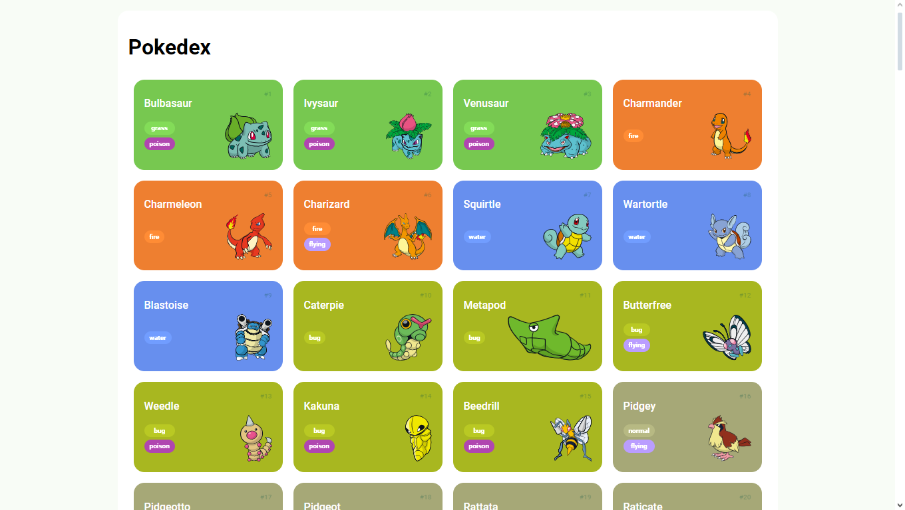

# Pokédex DIO - Projeto de Curso

<p align="center" >
  
</p>


Bem-vindo à Pokédex desenvolvida como parte do curso da Digital Innovation One! Este projeto tem como objetivo explorar conceitos avançados de JavaScript e integração de APIs para criar uma interface interativa que exibe informações básicas sobre os Pokémon da 1ª geração.

## Funcionalidades

- **Lista de Pokémon:** Explore os 151 Pokémon da primeira geração, exibindo o número, nome, tipo e imagem de cada um.

- **Sistema de Paginação:** Navegue de 10 em 10 Pokémon até chegar ao 151° Pokémon.

## Funcionamento

A aplicação utiliza conceitos avançados de JavaScript para buscar e exibir os dados dos Pokémon por meio de uma API confiável. A página principal apresenta os Pokémon em uma lista paginada, exibindo informações básicas como número, nome, tipo e imagem.

## Capturas de Tela

<p align="center" >
  
</p>

## Como Usar

```bash
  # Clone ou faça o download do repositório. 
  $ git clone https://github.com/Luiiz-Henrique/Pokedex.git

  # Navegar até a pasta
  $ cd Pokedex

  # Instalar dependências 
  $ npm install

  # Iniciar a aplicação
  $ http-server.cmd
```

## Objetivos do Projeto

O principal objetivo deste projeto foi explorar os seguintes conceitos:

- Uso avançado de JavaScript para manipulação do DOM e requisições assíncronas.
- Integração de APIs para obter e exibir dados dinâmicos na aplicação.
- Criação de uma interface interativa e responsiva para apresentar informações básicas sobre os Pokémon.

---

*Este projeto é apenas para fins educacionais e de aprendizado, não possui fins lucrativos e não está oficialmente associado à franquia Pokémon.*
